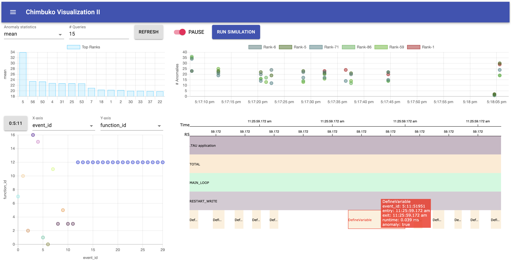

# ChimbukoVisualizationII

Scalable Visualization Module for Chimbuko

## Overview 

The visualization module of Chimbuko provides a real-time inspection of the identified anomalous performance behaviors. It receives rank-wise statistics streams from Chimbuko anomaly detection module. It also serves as the interface to query back end provenance database online for a deeper investigation of function executions in selected time intervals. This module consists of two major components as below.

### In-situ Performance Statistics Visualization
* `Dynamic Top MPI Ranks and CPU/GPU Counters`: Streaming data from the anomaly detection module is processed into a number of anomaly statistics including the average, standard deviation, maximum, minimum and the total number of anomalous function executions. Users can select a statistic along with the number of ranks for which it is visualized. A dynamic “ranking dashboard" of the most problematic MPI ranks in a rank-level granularity is provided. A predefined list of CPU/GPU counters is also presented as additional information.
* `Selected Rank History`: Selecting corresponding ranks activates the visualization server to broadcast the number of anomalies per time frame (e.g., per second) of these ranks to the connected users while performance traced applications are running. This streaming scatter plot serves as a time frame-level granularity by showing the dynamic changes of anomaly amount of a MPI rank within a time interval. 

### Online Detailed Functions Visualization
For a selected time interval, this visualization is designed to retrieve data from the provenance database and show the function execution details. It consists of two parts: a function view and a timeline view.
* `Projection of Function Executions`: In the function view, it visualizes the distribution of functions executed within a selected time interval. The distribution can be controlled by selecting the X- and Y-axis among different function properties.
* `Timeline and Message Communication Visualization`: In the timeline view, users can more closely investigate a selected function execution in details. The invocation relationships among functions (call stacks), adjacent functions in the same time interval, and their communications over other ranks are presented for users to interpret the potential cause of the anomalous behavior.
